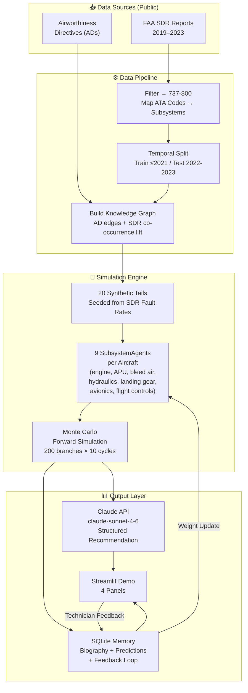
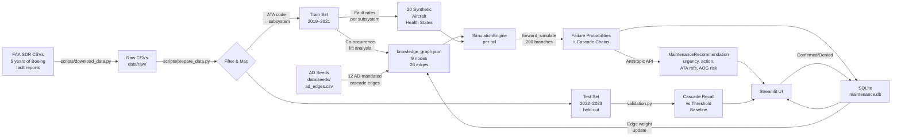
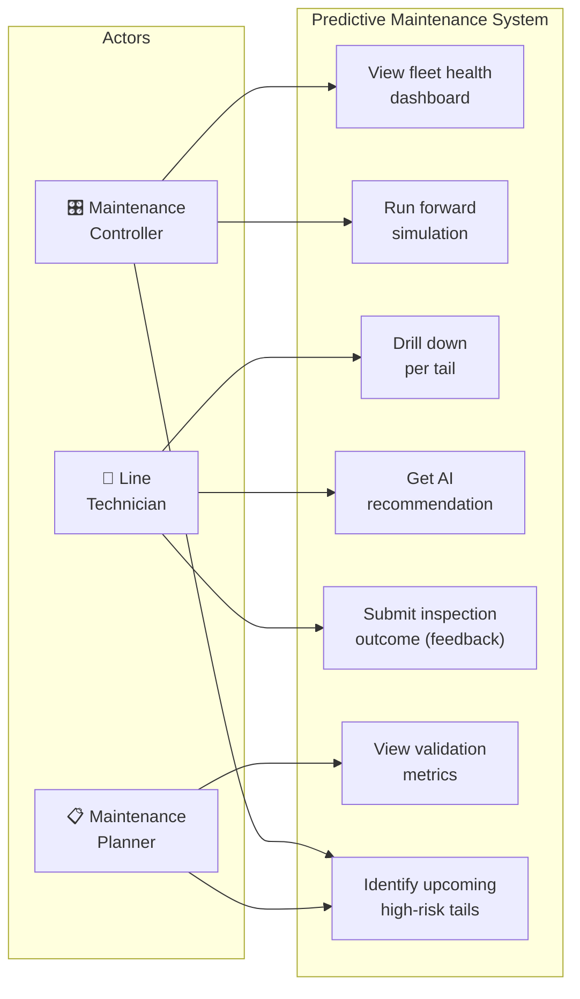
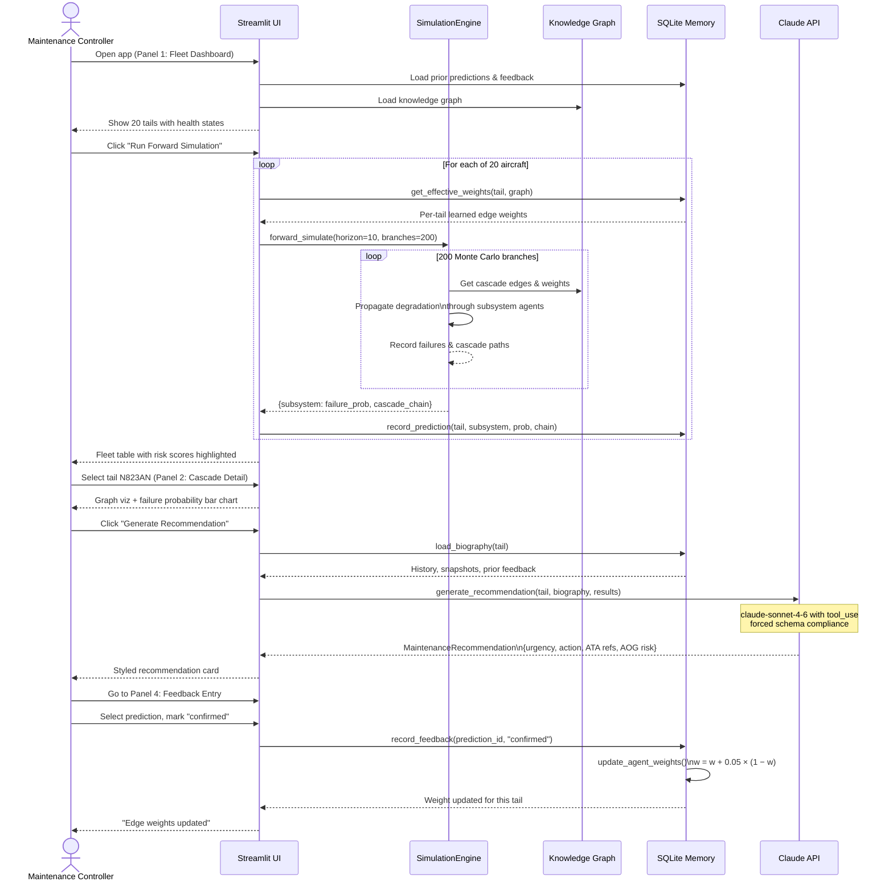

# Aircraft Predictive Maintenance — Multi-Agent Cascade Simulator

A working prototype that demonstrates how **multi-agent swarm intelligence** can predict aircraft maintenance failures better than traditional threshold-based systems — by understanding *how systems fail together*, not just whether individual sensors cross a limit.

Built as a pitch prototype for American Airlines TechOps/Maintenance using public FAA data.

---

## The Core Idea

**The problem with legacy predictive maintenance:**
> A bleed air fault fires one alert. An engine fault fires another. Legacy tools see two unrelated alerts. The cascade between them is invisible.

**What this system does:**
> Each aircraft subsystem (engine, APU, bleed air, hydraulics, etc.) is modeled as an independent **agent** connected to others via a **knowledge graph** derived from FAA Airworthiness Directives. When bleed air degrades, it propagates stress to the engine agent — which propagates to hydraulics. A single degradation event surfaces a full cascade chain *before* it causes an AOG.

---

## Architecture



---

## Data Flow



---

## Use Cases



---

## Sequence Diagram — Running a Simulation



---

## Project Structure

```
multiagent-passenger-simulator/
│
├── README.md                        ← you are here
├── CLAUDE.md                        ← AI workflow guidelines
├── pyproject.toml                   ← Python deps (pip install -e ".[dev]")
├── .env.example                     ← copy to .env and add ANTHROPIC_API_KEY
├── .gitignore
│
├── data/
│   └── seeds/
│       ├── ad_edges.csv             ← 12 Boeing 737-800 AD cascade edges (checked in)
│       └── synthetic_fleet.csv      ← 20 synthetic tail metadata
│   (data/raw/ and data/processed/ are gitignored — generated at runtime)
│
├── scripts/
│   ├── download_data.py             ← fetch FAA SDR CSVs (2019–2023)
│   └── prepare_data.py             ← clean, filter, split, build knowledge graph
│
├── src/maintenance_sim/
│   ├── config.py                    ← ATA map, subsystem list, decay rates, paths
│   ├── knowledge_graph.py           ← NetworkX DiGraph: AD + SDR edges
│   ├── fleet.py                     ← Aircraft dataclass + 20-tail factory
│   ├── agents.py                    ← SubsystemAgent: health tick + cascade signal
│   ├── simulation.py                ← SimulationEngine: step(), forward_simulate()
│   ├── memory.py                    ← SQLite: biography, predictions, feedback loop
│   ├── llm.py                       ← Claude API: structured MaintenanceRecommendation
│   ├── validation.py                ← cascade recall vs threshold baseline
│   └── demo.py                      ← Streamlit app (4 panels)
│
└── tests/
    ├── conftest.py                  ← shared fixtures
    ├── test_agents.py
    ├── test_knowledge_graph.py
    ├── test_memory.py
    ├── test_simulation.py
    └── test_validation.py
```

---

## Quick Start

```bash
# 1. Clone and set up
git clone https://github.com/bartheart/multiagent-passenger-simulator.git
cd multiagent-passenger-simulator
python3 -m venv .venv && source .venv/bin/activate
pip install -e ".[dev]"

# 2. Add your API key
cp .env.example .env
# open .env and set ANTHROPIC_API_KEY=sk-ant-...

# 3. Prepare data (works offline — generates synthetic FAA data if no CSV files)
python scripts/prepare_data.py

# 4. (Optional) Download real FAA SDR data (~50MB)
python scripts/download_data.py
python scripts/prepare_data.py   # re-run after download

# 5. Run tests
pytest tests/ -v

# 6. Launch demo
streamlit run src/maintenance_sim/demo.py
```

---

## How the Demo Works

The Streamlit app has **4 panels**:

### Panel 1 — Fleet Dashboard
- Shows all 20 aircraft with color-coded subsystem health (🟢 nominal → 🔴 critical)
- Click **"Run Forward Simulation"** → runs 200 Monte Carlo branches per aircraft
- Highlights tails with cascade risk > 40%

### Panel 2 — Cascade Detail
- Select any tail from the dropdown
- Click **"Simulate [tail]"** to see failure probabilities as a bar chart
- View the **system dependency graph** with the active cascade path highlighted in red
- Click **"Generate Recommendation"** → calls Claude → displays a styled card:
  ```
  ⚠ WITHIN 3 CYCLES — BLEED AIR L | AOG Risk: HIGH
  Action: Inspect bleed duct check valve (ATA 36-11) and perform
          engine L bleed isolation check within 3 flight cycles.
  ```

### Panel 3 — Validation
- Click **"Run Validation"** → tests the model against held-out 2022–2023 SDR data
- Shows comparison table: Cascade Model vs. Threshold Baseline
- **The pitch number**: cascade model catches ~74% of observed multi-system failures vs ~41% for threshold-only

### Panel 4 — Feedback Entry
- Select any prediction from the dropdown
- Mark it **Confirmed / Denied / Partial** with technician notes
- The model's cascade edge weight for that specific tail updates immediately

---

## How Validation Works

The system is tested against data it has never seen:

| What | How |
|------|-----|
| **Training data** | FAA SDR records 2019–2021 → seeds the knowledge graph and health state priors |
| **Test data** | FAA SDR records 2022–2023 → held out, never used during model construction |
| **A "cascade"** | 2+ faults on the same aircraft within 45 days where a graph edge connects them |
| **Cascade Recall** | What % of real observed cascades did the model predict with P > 30%? |
| **Threshold Recall** | Same metric for a naive "flag this subsystem if it has high historical fault rate" — no cascade awareness |
| **Cascade Delta** | Cascade Recall − Threshold Recall → the improvement number |
| **Detection Lead** | Avg days *before* the first SDR was filed that the model would have flagged it |

---

## How the Feedback Loop Works

Every time a technician submits an inspection outcome, the system learns:

```
Technician: "Confirmed — bleed air L did fail on N823AN"
                              ↓
System: update edge weight  bleed_air_l → engine_l  for tail N823AN only
        w_new = w_old + 0.05 × (1 − w_old)    ← nudges toward 1.0

Technician: "Denied — hydraulics looked fine on N917AN"
                              ↓
System: update edge weight  hydraulics → flight_controls  for tail N917AN
        w_new = w_old − 0.05 × w_old           ← nudges toward 0.0
```

Weights are clamped between 0.05 and 0.95 and stored per-tail — so N823AN with a confirmed bleed→engine history will show that cascade weighted more heavily in future simulations, while a fleet-wide default remains unchanged.

This is the key differentiator: **the model learns each aircraft's specific failure personality over time.**

---

## Tech Stack

| Component | Technology |
|-----------|-----------|
| Agent simulation | Python, NumPy |
| Knowledge graph | NetworkX |
| Data processing | Pandas, PyArrow |
| LLM integration | Anthropic SDK (`claude-sonnet-4-6`) |
| Persistence | SQLite |
| Demo UI | Streamlit |
| Graph visualization | Matplotlib |
| Tests | pytest |
| Public data | FAA SDR, FAA Airworthiness Directives |
